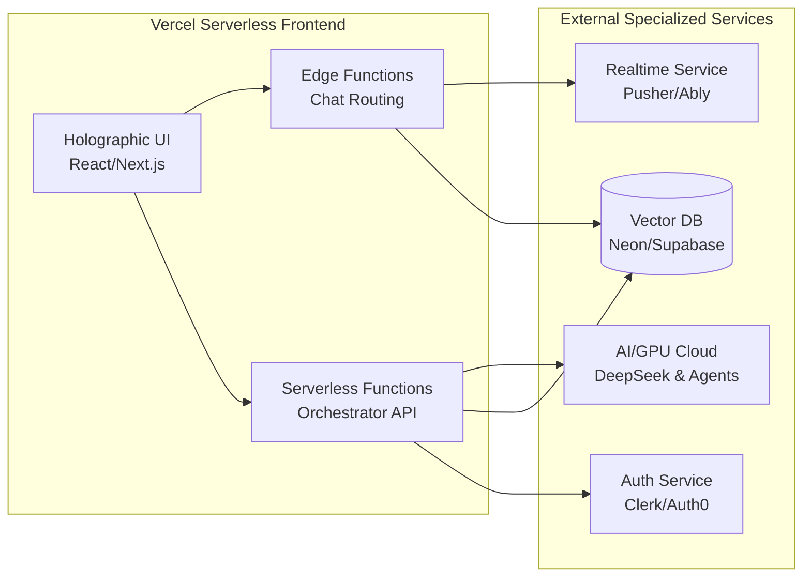

# USAMind on Vercel: Hybrid Serverless Blueprint

## High-Level Architecture
- **Frontend (Vercel)**: Next.js app (UI/UX, holographic styling) served via static/ISR + serverless/edge API routes.
- **External Services**: AI agents on GPU cloud, managed Postgres/pgvector (Neon/Supabase), realtime (Pusher/Ably), auth (Clerk/Auth0), optional orchestrator.
- **API Orchestration**: Vercel Functions/Edge Functions call external services; keep heavy compute off Vercel.



## Components and Placement
| Component | Placement | Notes |
| --- | --- | --- |
| Holographic UI | Vercel (Next.js) | Static/ISR pages; Three.js/glass morphism stays client-side. |
| Chat/Realtime | External + Vercel Edge | Use Pusher/Ably; Vercel route proxies publish calls. |
| AI Agents | GPU cloud | Expose REST endpoints; Vercel calls them. |
| Vector DB | Managed Postgres | Neon/Supabase with pgvector. |
| Auth | External | Clerk/Auth0; session tokens validated in Vercel routes. |
| Orchestrator | Vercel Functions | Lightweight traffic cop for AI/DB/auth. |

## Repo Layout (target)
```
USAMIND/                # frontend for Vercel
  app/                  # Next.js app router
  components/
  public/
  src/app/api/          # Vercel serverless routes (lightweight)
agents/                 # AI services (deploy to GPU cloud)
  legislative-predictor/
  constitutional-ai/
orchestrator/            # Optional extra services (or keep in /api)
```

## Implementation Steps
1) **Provision**: Create Vercel project; set env vars for AI/DB/Realtime/Auth endpoints. Use `vercel.json` to allow longer runtimes.
2) **Database**: Stand up Neon/Supabase with pgvector; migrate schema; set `NEON_VECTOR_SEARCH_URL`.
3) **AI Agents**: Containerize and deploy (RunPod/Replicate/Banana). Set `LEGISLATIVE_PREDICTOR_URL`.
4) **Realtime**: Configure Pusher/Ably; set `REALTIME_PUBLISH_URL` and `REALTIME_PUBLISH_KEY`.
5) **Auth**: Integrate Clerk/Auth0; validate tokens in API routes.
6) **API Routes**: Use `/api/analyze-bill` and `/api/send-message` as patterns—keep logic thin and offload heavy work.
7) **Caching**: Add Vercel Edge Config / data cache for frequently accessed read paths.
8) **Monitoring**: Use Vercel Analytics + external dashboards; add budget alerts on Neon/Pusher/RunPod.

## Environment Variables (minimum)
- `LEGISLATIVE_PREDICTOR_URL`
- `NEON_VECTOR_SEARCH_URL`
- `API_AUTH_TOKEN` (shared secret for upstream services)
- `REALTIME_PUBLISH_URL`
- `REALTIME_PUBLISH_KEY`
- Auth provider keys (e.g., `CLERK_SECRET_KEY`, `AUTH0_SECRET`, etc.)

## Notes
- Keep heavy compute streaming results to avoid 300s limit.
- Prefer fetch over direct SDKs in routes to keep bundle size small.
- Place GPU/DB services in regions close to Vercel edge/region for latency.
